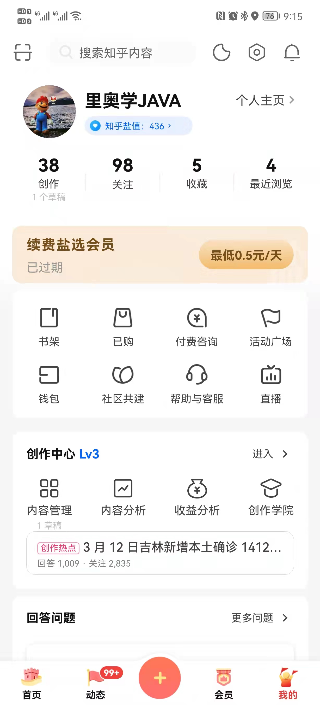
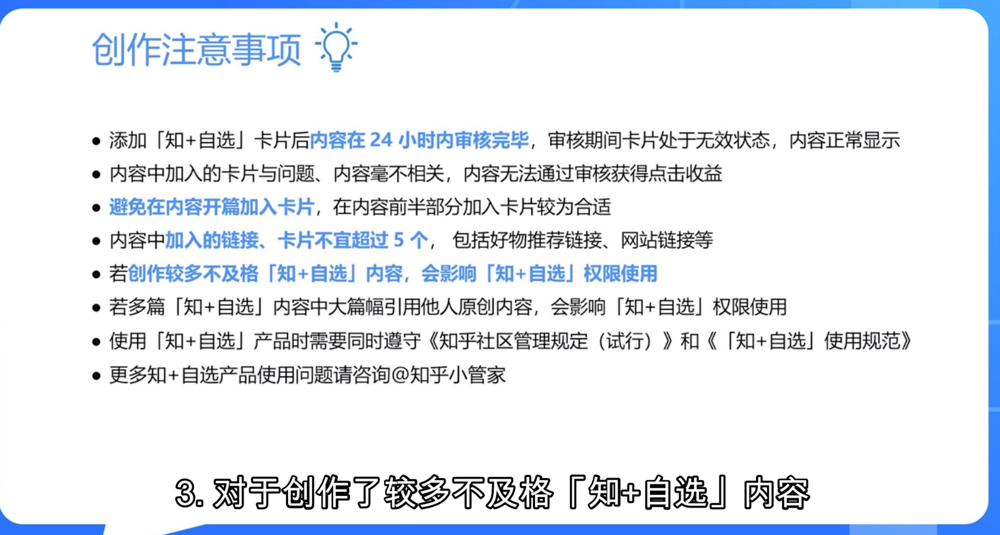

## 0312破冰

## Day01 

## 训练营规则

当天 9点发任务 次日中午1点完成作业安排

【腾讯文档】1组—作业提交表
https://docs.qq.com/sheet/DUnhnQ0ZHVXVhdkhL

https://shimo.im/docs/NJkbEyW84ycDX2qR/ 《知乎引流训练营第二期课程大纲》

7点到8点 问答

微笑：热点 微信红包 状态包

盐值 500 5级

抖音 B站 知乎 视频门槛较高

 不会笑 ：时间 态度

- 目标 
   
  1. 引流一个粉丝到微信或者公众号
   2. 盐值 500+  等级大于5级
  3. 掌握知乎养号，引流的方法， 了解知乎商业价值
   4. 一个月养成一个习惯，训练营其实只有一个开端
   
   
   
- 定位 

  1. 核心：叠加领域权重

  2. 配套：头像、封面、主页介绍等

  3. 建议：尽量事自己熟悉的领域

  4. 补充：如何刻意练习 

     1. 学习，比如阅读对应领域有分量的10本书籍
     2. 模仿，关注领域大V，模仿学习等等

     作用

     1. 提升领域专业性

     2. 建立自身素材库

- 养号 

   - 丛林法则

      1. 肉眼可见的正反馈
      2. 增加自身健壮性
      3. 磨刀不误砍柴功，后续引流操作事半功倍

   - ⚠️

      1. 知乎社区规范

      2. 会员？

      3. 创作等级 个人能力
         用户创作行为（包括回答、文章、视频、视频回答、直播、提问）

         数量、质量、影响力点综合指数   1级最低、10级最大、越高越强大

      4. 盐值体系 （综合素质） 

         目前是每周更新一次 只有在手机端可以查看

         盐值越高，你的账号权重越高，抗风险能力越强。

      5. 领域权重 行业水平

         1. 不要大而范，要做到小而准
         2. 女里做到细分赛道的头部

   术和道

   术：等级考视频，盐值靠举报

   道：长期有价值的输出才是根本。

   

   里奥学JAVA 盐值 436 创作等级LV3

# 个人目标

- 引流一个粉丝到微信或者公众号
- 盐值 500 等级5级
- （个人）盐值 600 等级6级
- 掌握知乎养号，引流的方法 了解知乎商业价值

## 0315

今日操作：

好物推荐开通

动态置顶开通

知+自选 申请待审核

