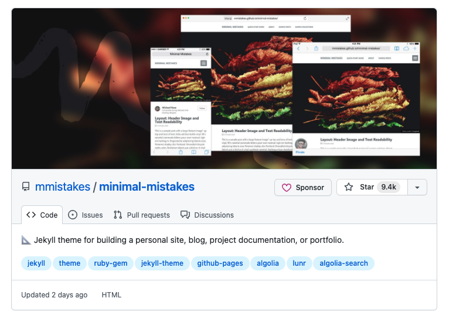

### 背景知识

[jekyllcn]: https://jekyllcn.com/	"1"

## Jekyll 究竟是什么？[Permalink](https://jekyllcn.com/docs/home/#jekyll-究竟是什么)

<!--Jekyll 是一个简单的博客形态的静态站点生产机器。它有一个模版目录，其中包含原始文本格式的文档，通过一个转换器（如 [Markdown](http://daringfireball.net/projects/markdown/)）和我们的 [Liquid](https://github.com/Shopify/liquid/wiki) 渲染器转化成一个完整的可发布的静态网站，你可以发布在任何你喜爱的服务器上。Jekyll 也可以运行在 [GitHub Page](http://pages.github.com/) 上，也就是说，你可以使用 GitHub 的服务来搭建你的项目页面、博客或者网站，而且是**完全免费**的。-->

## 基础要求：

1. 有github账号 
2. 可以访问到github （这里需要有翻墙能力）

### 目标

无代码基础搭建自己的博客

### 步鄹

1. 可以直接从这里选择一个主题

https://github.com/topics/jekyll-theme

2. Fork  这里选择的minimal-mistakes主题

    可以直接访问https://github.com/itmacoder/minimal-mistakes  并这里点击

3. 修改仓库名为  {自己的名字}+.github.io     我自己的举例 eg: itmacoder.github.io  

   访问fork的仓库，并点击Settings页，

   

4. 在当前面下切到Code页面找到并修改_config.yml

修改_confid.yml 

- name : itmacoder

- url :   https://itmacoder.github.io

- 提交

5. 稍等2分钟 访问https://itmacoder.github.io/

博客内容比较简单 后期再来看丰富博客