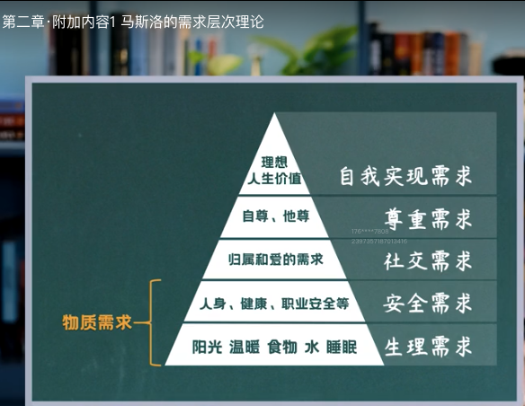

##  2经济学的基础方法

宏观经济学 微观经济学

## 2.4机会成本

## 2.5沉没成本

1、什么是沉没成本  

​	舔🐶 

​	帮助过自己的人更愿意帮助我们

​    买房子 销售的沉默成本

2、沉没成本有什么用

## 2.6边际分析

追加

边际成本 边际收益

## 2.7存量与增量

车辆北斗设备

绿植

窗帘 

健身房 应该做存量 增量很小

保险公司 存量和增量都很高 

信用卡销售 增量 存量都很小

房产销售 做的是存量市场

弹个车 目标客户存量和增量都很低 

## 2.8个体选项优化

### 预算约束与可行选项

 现有资源上限  

不在掌控之中不能纳入资源

 预算约束的所有可选项

### 权衡选项-成本收益分析

合伙创业 边际分析 多少和程度

### 激励

​	降息 成本收益的变化 会改变人的选择

​	亲疏关系

## 2.9群体均衡

1. 群体分析 考场等电梯
2. 均衡 不再改变
3. 合成谬误 收废纸箱注水
4. 搭便车 个人利益和群体利益冲突的情况下 轮流打扫卫生

## 2.10模型与数据检验

做模型的4个步骤    -好的模型能产出一个道理

1. 设定一个假说
2. 解释假说    
3. 数据校验   自然实验法 调查法  经济实验法
4. 查看结果

## 2.11归因谬误

海底捞 客人很多 因素 1、服务 2、管理制度 3、供应链

1. 把先后发生的两件事当成因果关系  不是因果关系   陆家嘴租的房子 珍大户养猫的故事
   科学和玄学 选择能够掌控和把握规律的 自己能够掌握的就是科学不能掌握的就是玄学
2. 把同时发生的两类事当成因果关系 
   遗漏因素  反向因果 巧合

## 马斯洛的需求层次理论

## 3.1需求demand

需求量 

需求定律

需求曲线

需求变动：推动需求曲线移动

## 3.2供给

供给量 供给意愿 供给能力

供给定律 

怎么写商业技术书	

站在公司的角度看问题才能做公司领导层 

站在行业高度看问题才能做企业高管

自上而下 先整个行业的总需求现状分析以及未来需求变化趋势分析 再根据上层分析到公司层面的影响

小对大差异化  大堆小正面化

健身房的例子

买不要买车位？

## 3.3市场均衡与价格形成

口罩 汶川帐篷

均衡价格不一定是好的 是规范经济学的描述

钻石和水  的价格 价格不是价值的体现 而是供需关系的体现

《大空头》

养猪 价格信号滞后

### 怎么预测小经济周期 

小周期 

PPI 生产者价格指数

CPI 消费价格指数

PMI 采购经理人指数 3000家采样调研  45-55 当月22-25调查当月低可以出来

**春江水暖鸭先知**

教育孩子 个人打造稀缺性

租房 11-次年2月 房租最低   3、4月 7、8最贵 3月最高跳槽的人多

考证 

白芳礼老人

# 第二模块 消费者是怎么选择的

## 效用 

经济学用词

总效用 总边际效用 

边际效用递减