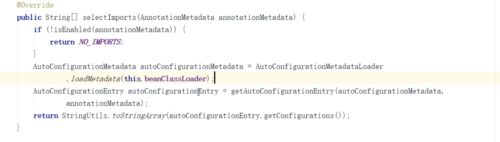

## **Springboot** **核心原理**

Hello，大家好，我是今天的讲师Marvin，本名叫马文浩。马云的马，大家应该都认识马爸爸，我和马爸爸差了一点。

为什么说差了一点，因为我总结马爸爸有3个特点 第一姓马、第二当过老师、第三有钱，我和他差了一点 钱。

开个玩笑吹个牛皮，但我估计他技术应该是不如我的，这是我的个人经历，

> 10年JAVA开发经验，当过项目经理，当过技术部门负责人，有过技术团队从0到1的带队经历。
>
> 分别在郑州、广州、上海、杭州奋斗过。有打算要去这些城市的可以找我聊下，可以给你分享下我的感受


>  话题  裁员  蘑菇街、有赞、JD、腾讯 具体的我就不讲了，相信大家在很多渠道和文章都看过。
>
>  这些互联网大厂都在裁员，对普通程序员有什么启示？

第一要在技术上修炼内功，毕竟水位下降才知道谁在裸泳，打酱油的没真功夫的很容易被淘汰，或者优先被淘汰。

第二要在职业上要有自己的规划，提前布局，将来是打算做管理还是打算做架构，现在就要开始准备了，按目标要求自己不断的学习，才能更接近目标。

主题：springboot核心原理

目的：提升大家对springboot的认知，能够真正理解springboot的精髓-约定优于配置。


今天我们来讲下spring boot，大概需要30分钟，请大家记好安全带，我们要发车了！！！

不管是 spring cloud alibaba 还是 spring cloud netflix，都是基于 springboot 这个微框架来构建的，所以我希望花一 点时间来讲一下 springboot

### 什么是 springboot

> Spring Boot makes it easy to create stand-alone, production-grade Spring based Applications that you can "just run".

springboot 框架是为了能够帮助使用 spring 框架的开发者 快速高效的 构建一个基于 spirng 框架以及 spring 生态体系 的应用解决方案。它是一个服务于框架的框架，服务的范围是简化配置 文件。

### 为什么会出现springboot

对于 spring 框架，我们接触得比较多的应该是 spring mvc、 和 spring。而 spring 的核心在于 IOC(控制反转)和 DI/DL (依赖注入)。

而这些框架在使用的过程中 会需要配置大量 的 xml，或者需要做很多繁琐的配置。

> ssh/ssm  struts2 hibernate  mybatis   
>
> struts.xml web.xml   spring-mvc.xml
>
> hibernate.cfg.xml
>
> spring.xml
>
> applicationContext.xml 
>
> ```xml
> <bean id="customerAction" class="com.xxx.web.action.CustomerAction" scope="prototype/>                                                           
> ```

你会怎么办 如何优化？  内部脚手架

发展的过程

> 1.xml
>
> 2.JavaConfig 
>
> 3.Enable
>
> 4.EnableAutoConfiguration

###  怎么办？---> springboot

>  它是对“约定优于配置”这个理念下 的一个最佳实践。

#### 项目结构规范

1. maven 的目录结构

 a) 默认有 resources 文件夹存放配置文件

 b) 默认打包方式为 jar

2. starter  

   >  spring-boot-starter-web 中默认包含 spring mvc 相关依赖 以及内置的 tomcat 容器，使得构建一个 web 应用 更加简单

3. 默认提供 application.properties/yml 文件

4. 默认通过 spring.profiles.active 属性来决定 运行环境时 读取的配置文件

5. **EnableAutoConfiguration 默认对于依赖的 starter 进行自动装载**

#### SPI机制引入

为了给大家补一下基础，我在这里简单讲下

> SPI机制（Service Provider Interface)其实源自服务提供者框架，是一种将服务接口与服务实现分离以达到解耦、大大提升了程序可扩展性的机制。引入服务提供者就是引入了spi接口的实现者，通过本地的注册发现获取到具体的实现类，轻松可插拔

SpringFactoriesLoader

这里简单分析一下 SpringFactoriesLoader 这个工具类的使用。它其实和 java 中的 SPI 机制的原理是一样的，不过它比 SPI 更好的 点在于不会一次性加载所有的类，而是根据 key 进行加 载。

首 先 ， SpringFactoriesLoader 的 作 用 是 从 classpath/META-INF/spring.factories 文件中，

根据 key 来 加载对应的类到 spring IoC 容器中。

#### 从 SpringBootApplication 注解入手

为了揭开 springboot 的奥秘，我们直接从 Annotation 入 手，看看@SpringBootApplication 里面，做了什么? 

打开 SpringBootApplication 这个注解，可以看到它实际上 是一个复合注解

``` java
@Target(ElementType.TYPE)
@Retention(RetentionPolicy.RUNTIME)
@Documented
@Inherited
@SpringBootConfiguration
@EnableAutoConfiguration
@ComponentScan(excludeFilters = { @Filter(type = FilterType.CUSTOM, classes = TypeExcludeFilter.class),
		@Filter(type = FilterType.CUSTOM, classes = AutoConfigurationExcludeFilter.class) })
public @interface SpringBootApplication {
```

 SpringBootApplication 本质上是由 3 个注解组成，分别是 

1. @Configuration

3. @ComponentScan 

3. @EnableAutoConfiguration

   我们直接用这三个注解也可以启动 springboot 应用,

   只是每次配置三个注解比较繁琐，所以直接用一个复合注解更方便些。
   然后仔细观察这三个注解，除了 EnableAutoConfiguration 可能稍微陌生一点，

   其他两个注解使用得都很多

##### 1. 简单分析@Configuration

Configuration 这个注解大家应该有用过，它是 JavaConfig形式的 基于 Spring IOC 容器的 配置类 使用的一种注解。

因为SpringBoot 本质上就是一个 spring 应用，所以通过这个注解来加载 IOC 容器的配置是很正常的。

这里在启动类 里面标注了@Configuration，意味着它其实也是一个 IoC 容器的配置类。

传统意义上的 spring 应用都是基于 xml 形式来配置 bean 的依赖关系。然后通过 spring 容器在启动的时候，把 bean 进行初始化，

如果 bean 之间存在依赖关系，则分析这些已经在 IoC 容器中的 bean 根据依赖关系进行组装。 

直到 Java5 中，引入了 Annotations 这个特性，Spring 框架也紧随着推出了基于 Java 代码和 Annotation 元信息的依赖关系  

绑定描述的方式。也就是 JavaConfig。

 从 spring3 开始，spring 就支持了两种 bean 的配置方式， 一种是基于 xml 文件方式、另一种就是 JavaConfig 

任何一个标注了@Configuration 的 Java 类定义 都是一个 JavaConfig 配置类。

而在这个配置类中，任何标注了 @Bean 的方法，它的返回值都会作为 Bean 定义注册到 Spring 的 IOC 容器，

方法名默认成为这个 bean 的 id。

@Configuration标注在类上，相当于把该类作为spring的xml配置文件中的`<beans>`，作用就是：配置spring容器(应用上下文)

##### 2. 简单分析 ComponentScan

ComponentScan 这个注解是大家接触得最多的了，相当 于 xml 配置文件中的<context:component-scan>。

> <context:component-scan base-package="me.dao.xx.service" />

 它的主要作用就是扫描指定路径下的标识了需要装配的类，自动装配到 spring 的 Ioc 容器中。

问题？

 标识需要装配的类的形式主要是:@Component、 @Repository、@Service、@Controller 这类的 注解标识的类。

ComponentScan 默认会扫描当前 package 下的的所有加了相关 注解标识 的类到 IoC 容器中;

##### 3. 简单分析 EnableAutoConfiguration

我们把 EnableAutoConfiguration 放在最后讲的目的 并不是说它是一个新的东西，只是他对于 springboot 来说意义 重大。

###### Enable注解

Enable并不是新鲜玩意 

仍然是在 spring3.1 版本中，提供了一系列的@Enable 开 头的注解，Enable 应该是在 JavaConfig 框架上更进一 步的完善，

是用户在使用 spring 相关的框架时，避免配置大量的代码从而降低使用的难度。升级

比如常见的一些 Enable 注解:EnableWebMvc，(这个注解引入了 MVC 框架在 Spring 应用中需要用到的所有 bean); 

比如说@EnableScheduling，开启计划任务的支持;

<!--代码-->

找到 EnableAutoConfiguration，我们可以看到每一个涉及 到 Enable 开头的注解，都会带有一个@Import 的注解。 

``` java
@Import(AutoConfigurationImportSelector.class)
public @interface EnableAutoConfiguration {
```

###### Import 注解

import 注解是什么意思呢? 联想到 xml 形式下有一个 <import resource/> 形式的注解，就明白它的作用了。

 import 就是把多个分类的容器配置合并在一个配置中。在 JavaConfig 中所表达的意义是一样的。

```
@Import(xxx,xxx)
```

Enable 注解不仅仅可以像前面演示的案例一样很简单的实 现多个 Configuration 的整合，还可以实现一些复杂的场景，

比如可以根据上下文来激活不同类型的 bean， 

@Import 注解可以配置三种不同的 class

1. 第一种就是前面演示过的，基于普通 bean 或者带有 @Configuration 的 bean 进行注入

2. 实现 ImportSelector 接口的类 进行动态注入
3. 实现 ImportBeanDefinitionRegistrar 接口的类 进行动态注入

###### EnableAutoConfiguration 注解的实现原理

EnableAutoConfiguration 的 主 要 作 用  其实就是帮助springboot 应用把所有符合条件的@Configuration 配置

 都加载到当前 SpringBoot 创建并使用的 IoC 容器中。 

了解了 ImportSelector 和 ImportBeanDefinitionRegistrar 后，对于 EnableAutoConfiguration 的理解就容易一些了 

它会通过 import 导入第三方提供的 bean 的配置类: 

```  java
AutoConfigurationImportSelector 

@Import(AutoConfigurationImportSelector.class)
```

从名字来看，可以猜到它是基于 ImportSelector 来实现 基于动态 bean 的加载功能。

之前我们讲过 Springboot @Enable*注解的工作原理

那么可以猜想到这里的实现原理也一定是一样的，定位到 AutoConfigurationImportSelector 这个类中的 selectImports 方法

 ImportSelector 接口 selectImports 返回的数组(类的全类名)都会被纳入到 spring 容器中。 
```java
    public String[] selectImports(AnnotationMetadata annotationMetadata) {
        if (!this.isEnabled(annotationMetadata)) {
            return NO_IMPORTS;
        } else {
            AutoConfigurationImportSelector.AutoConfigurationEntry autoConfigurationEntry = this.getAutoConfigurationEntry(annotationMetadata);
            return StringUtils.toStringArray(autoConfigurationEntry.getConfigurations());
        }
    }
```

```java
    protected List<String> getCandidateConfigurations(AnnotationMetadata metadata, AnnotationAttributes attributes) {
        List<String> configurations = new ArrayList(SpringFactoriesLoader.loadFactoryNames(this.getSpringFactoriesLoaderFactoryClass(), this.getBeanClassLoader()));
       ImportCandidates.load(AutoConfiguration.class,this.getBeanClassLoader())
         .forEach(configurations::add);
        Assert.notEmpty(configurations, "No auto configuration classes found in META-INF/spring.factories nor in META-INF/spring/org.springframework.boot.autoconfigure.AutoConfiguration.imports. If you are using a custom packaging, make sure that file is correct.");
        return configurations;
    }
// key org.springframework.boot.autoconfigure.EnableAutoConfiguration
Enumeration urls = classLoader.getResources("META-INF/spring.factories");
```

本质上来说，其实 EnableAutoConfiguration 会帮助 springboot 应用把所有符合@Configuration 配置都加载 到当前 SpringBoot 创建的 IoC 容器，而这里面借助了 Spring 框架提供的一个工具类 SpringFactoriesLoader 的 支持。以及用到了 Spring 提供的条件注解 @Conditional，选择性的针对需要加载的 bean 进行条件 过滤。

**深入理解条件过滤**

在分析 AutoConfigurationImportSelector 的源码时，会 先扫描 spring-autoconfiguration-metadata.properties 文件，最后在扫描 spring.factories 对应的类时，会结合 前面的元数据进行过滤，为什么要过滤呢? 原因很多的@Configuration 其实是依托于其他的框架来加载的， 如果当前的 classpath 环境下没有相关联的依赖，则意味 着这些类没必要进行加载，所以，通过这种条件过滤可以 有效的减少@configuration 类的数量从而降低 SpringBoot 的启动时间。

> 2.7.0 AutoConfigurationMetadatal 
>
> 2.1.6

**Conditional** **中的其他注解**

| Conditions                   | 描述                                     |
| ---------------------------- | ---------------------------------------- |
| @ConditionalOnBean           | 在存在某个 bean 的时候                   |
| @ConditionalOnMissingBean    | 不存在某个 bean 的时候                   |
| @ConditionalOnClass          | 当前 classpath 可以找到某个类型的类时    |
| @ConditionalOnMissingClass   | 当前 classpath 不可以找到某个类型的类 时 |
| @ConditionalOnResource       | 当前 classpath 是否存在某个资源文件      |
| @ConditionalOnProperty       | 当前 jvm 是否包含某个系统属性为某个值    |
| @ConditionalOnWebApplication | 当前 spring context 是否是 web 应用程序  |

#### springboot 功能列表

 

### 什么时候用springboot

#### 什么是Starter

Starter 是 Spring Boot 中的一个非常重要的概念，Starter 相当于模块， 起步依赖

它能将模块所需的依赖整合起来并对模块内 的 Bean 根据环境( 条件)进行自动配置。

使用者只需要依赖相应功能的 Starter，无需做过多的配置和依赖，Spring Boot 就能自动扫描并加载相应的模块。

在 Maven 的依赖中加入 spring-boot- starter-web 就能使项目支持 Spring MVC，并且 Spring Boot 还为我们做了很多默认配置，无需再依赖 spring-web、 spring-webmvc 等相关包及做相关配置就能够立即使用起来

SpringBoot 存在很多开箱即用的 Starter 依赖，使得我们 在开发业务代码时能够非常方便的、不需要过多关注框架的配置，而只需要关注业务即可 

```shell
mvn dependency:tree // 依赖树
```


>  starter 命名方式
>
> 1. spring官方Spring-boot-starter-xxx.jar  
>
> 2. 第三方自己的 xxx-spring-boot-starter.jar

#### spring-boot-starter-logging

在实际应用中，日志是最重要的一个组件:

1. 它可以为系统提供错误以及日常的定位;
2. 也可以对访问的记录进行跟踪;
3. 当然，在很多大型的互联网应用中，基于日志的收集以及分析 可以了解用户的用户画像，比如兴趣爱好、点击行为。

常见的日志框架

可能是太过于常见了，所以使得大家很少关注，只是要用 到的时候复制粘贴一份就行，甚至连日志配置文件中的配 置语法都不清楚。

另外一方面，Java 中提供的日志组件太 多了，一会儿 log4j，一会儿 logback，一会儿又是 log4j2. 不清楚其中的关联

Java 中常用的日志框架: Log4j、Log4j 2、Commons Logging、Slf4j、Logback、Jul(Java Util Logging)

**简单介绍日志的发展历史**

最早的日志组件是 Apache 基金会提供的 Log4j，

log4j 能够通过配置文件 轻松的实现日志系统的管理和多样化配置，

所以很快被广泛运用。也是我们接触得比较早和比较多的 日志组件。

它几乎成了 Java 社区的日志标准。

据说 Apache 基金会还曾经建议 Sun 引入 Log4j 到 java 的 标准库中，但 Sun 拒绝了。

 所以 sun 公司在 java1.4 版本中，增加了日志库(Java Util Logging)。其实现 基本模仿了 Log4j 的实现。在 JUL 出来以前，Log4j 就已经成为一项成 熟的技术，使得 Log4j 在选择上占据了一定的优势。 Apache 推出的 JUL 后，有一些项目使用 JUL，也有一些项 目使用 log4j，这样就造成了开发者的混乱，因为这两个日 志组件没有关联，所以要想实现统一管理或者替换就非常 困难。怎么办呢? 

这个状况交给你来想想办法，你该如何解决呢?

进行抽象， 抽象出一个接口层，对每个日志实现都适配，这样这些提供给别人的库都直接使用抽象层即可

这个时候又轮到 Apache 出手了，它推出了一个 Apache Commons Logging 组件，JCL 只是定义了一套日志接口 (其内部也提供一个 Simple Log 的简单实现)，支持运行时 动态加载日志组件的实现，也就是说，在你应用代码里， 只需调用 Commons Logging 的接口，底层实现可以是 Log4j，也可以是 Java Util Logging 由于它很出色的完成了主流日志的兼容，所以基本上在后 面很长一段时间，是无敌的存在。连 spring 也都是依赖 JCL 进行日志管理

但是故事并没有结束
原 Log4J 的作者，它觉得 Apache Commons Logging 不够优秀，所以他想搞一套更优雅的方案，于是 slf4j 日志体系诞生了，

slf4j 实际上就是一个日志门面接口，它的作用 类似于 Commons Loggins。 并且他还为 slf4j 提供了一个 日志的实现-logback。
 因此大家可以发现 Java 的日志领域被划分为两个大营: Commons Logging 和 slf4j

另外，还有一个 log4j2 是怎么回事呢? 因为 slf4j 以及它 的实现 logback 出来以后，很快就赶超了原本 apache 的 log4j 体系，所以 apache 在 2012 年重写了 log4j， 成立 了新的项目 Log4j2 

总的来说，日志的整个体系分为日志框架和日志系统 

日志框架:JCL/ Slf4j 

日志系统:Log4j、Log4j2、Logback、JUL。 

而在我们现在的应用中，绝大部分都是使用 slf4j 作为门面， 然后搭配 logback 或者 log4j2 日志系统

### 回顾

作业：大家是否有些许都收获呢 ，你会实现自己的一个starter吗？

好的，这节课就到这里了，感谢大家，我们下次再见！！！

 