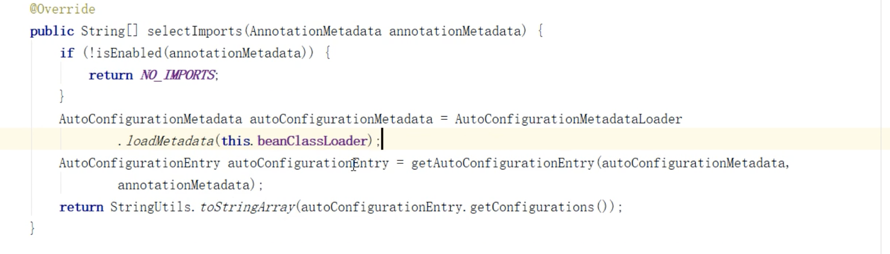
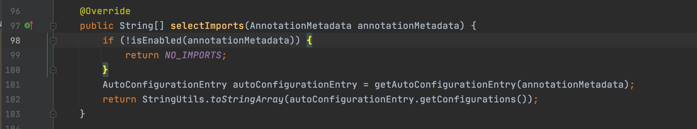

## **Springboot** **核心原理**


裁员  蘑菇街、有赞、JD、腾讯 

1内功

2职业规划

要求：

1. 有JAVA基础

2. 用过spring 

目的：提升大家对springboot的认知，能够真正理解springboot的精髓-约定优于配置。


### 什么是 springboot

> Spring Boot makes it easy to create stand-alone, production-grade Spring based Applications that you can "just run".

### 为什么会出现springboot 

1、导包

2.引入依赖


ssh/ssm  struts2 hibernate  mybatis   

struts.xml web.xml   spring-mvc.xml

hibernate.cfg.xml

spring.xml

applicationContext.xml 


###  怎么办？---> springboot

#### SPI机制

> SPI机制（Service Provider Interface)其实源自服务提供者框架，是一种将服务接口与服务实现分离以达到解耦、大大提升了程序可扩展性的机制。引入服务提供者就是引入了spi接口的实现者，通过本地的注册发现获取到具体的实现类，轻松可插拔

SpringFactoriesLoader

```
Enumeration urls = classLoader.getResources("META-INF/spring.factories");
```

```
org.springframework.boot.autoconfigure.EnableAutoConfiguration=\
org.mybatis.spring.boot.autoconfigure.MybatisLanguageDriverAutoConfiguration,\
org.mybatis.spring.boot.autoconfigure.MybatisAutoConfiguration
```

首 先 ， SpringFactoriesLoader 的 作 用 是 从 classpath/META-INF/spring.factories 文件中，

1. 项目结构规范

   1.  a) 默认有 resources 文件夹存放配置文件

       b) 默认打包方式为 jar

2. starter

   > spring-boot-starter-web 中默认包含 spring mvc 相关依赖 以及内置的 tomcat 容器，使得构建一个 web 应用 更加简单

3.application.properties/yml 文件

4.默认通过 spring.profiles.active 属性来决定 运行环境时 读取的配置文件

5. **EnableAutoConfiguration 默认对于依赖的 starter 进行自动装载**


```
@SpringBootConfiguration
@EnableAutoConfiguration
@ComponentScan(
```

1. @Configuration

   JavaConfig

   xml. <beans><bean > 

2. @ComponentScan 

   > > <context:component-scan base-package="me.dao.xx.service" />
   >
   > @Controller   @Service @ Repository @Component

3. @EnableAutoConfiguration

   ###### Enable注解

   EnableWebMvc 

   ```
   Import
   @Import(xxx,xxx)
   ```

   Configuration 

   ``` 
   EnableAutoConfiguration
   ```

   ```
   AutoConfigurationImportSelector
   ```

    public String[] selectImports(AnnotationMetadata annotationMetadata) {
        if (!this.isEnabled(annotationMetadata)) {
            return NO_IMPORTS;
        } else {
            AutoConfigurationImportSelector.AutoConfigurationEntry autoConfigurationEntry = this.getAutoConfigurationEntry(annotationMetadata);
            return StringUtils.toStringArray(autoConfigurationEntry.getConfigurations());
        }
    }
    
    


```
Enumeration urls = classLoader.getResources("META-INF/spring.factories");
```


ComponentScan

EnableAutoConfiguration

 META-INF/spring-autoconfigure-metadata.properties





#### SPI机制引入（SpringFactoriesLoader)

 

#### 从 SpringBootApplication 注解入手


 SpringBootApplication 本质上是由 3 个注解组成

#####  

###### Enable注解   3.1   

###### Import 注解 xml  

@Import 注解可以配置三种不同的 class

1. 第一种就是前面演示过的，基于普通 bean 或者带有 @Configuration 的 bean 进行注入

2. 实现 ImportSelector 接口 进行动态注入 
3. 实现 ImportBeanDefinitionRegistrar 接口进行动态注入

AutoConfigurationImportSelector.class


SpringFactoriesLoader

```
META-INF/spring.factories
```

```
META-INF/spring-autoconfigure-metadata.properties
```

**深入理解条件过滤**

> 2.7.0 AutoConfigurationMetadatal
>
> 2.1.6

**Conditional** **中的其他注解**

| Conditions                   | 描述                                     |
| ---------------------------- | ---------------------------------------- |
| @ConditionalOnBean           | 在存在某个 bean 的时候                   |
| @ConditionalOnMissingBean    | 不存在某个 bean 的时候                   |
| @ConditionalOnClass          | 当前 classpath 可以找到某个类型的类时    |
| @ConditionalOnMissingClass   | 当前 classpath 不可以找到某个类型的类 时 |
| @ConditionalOnResource       | 当前 classpath 是否存在某个资源文件      |
| @ConditionalOnProperty       | 当前 jvm 是否包含某个系统属性为某个值    |
| @ConditionalOnWebApplication | 当前 spring context 是否是 web 应用程序  |

在分析 AutoConfigurationImportSelector 的源码时，会 先扫描 spring-autoconfiguration-metadata.properties 文件，最后在扫描 spring.factories 对应的类时，会结合 前面的元数据进行过滤，为什么要过滤呢? 原因很多的@Configuration 其实是依托于其他的框架来加载的， 如果当前的 classpath 环境下没有相关联的依赖，则意味 着这些类没必要进行加载，所以，通过这种条件过滤可以 有效的减少@configuration 类的数量从而降低 SpringBoot 的启动时间。


#### springboot 功能列表


### 什么时候用springboot

#### 什么是Starter

#### spring-boot-starter-logging

>  starter 命名方式
>
> 1. spring官方Spring-boot-starter-xxx.jar  
>
> 2. 第三方自己的 xxx-spring-boot-starter.jar

### 回顾

作业：大家是否有些许都收获呢 ，你会实现自己的一个starter吗？

好的，这节课就到这里了，感谢大家，我们下次再见！！！

 